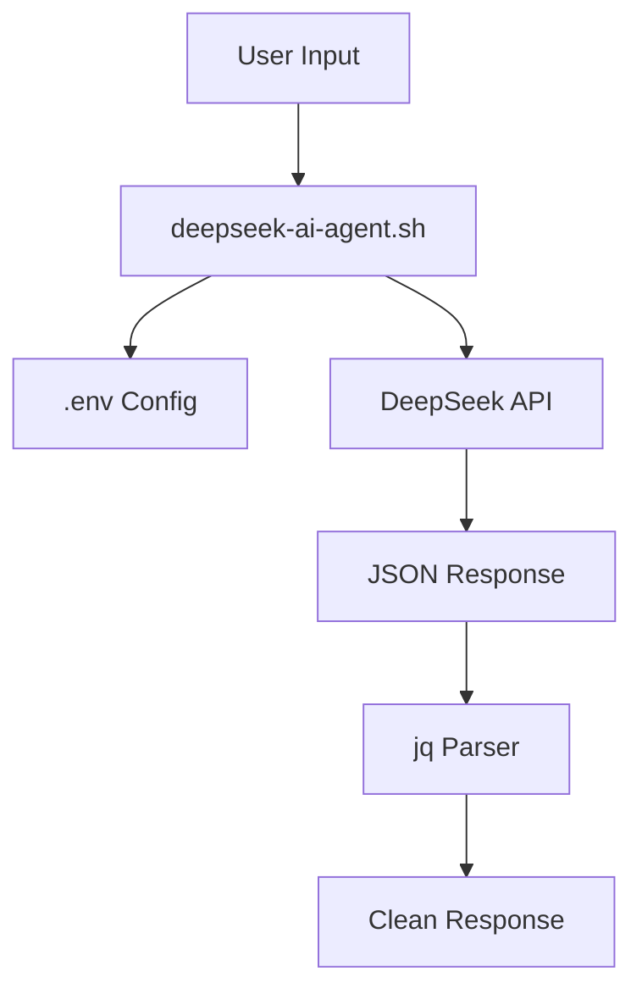

# DeepSeek AI Agent Repository 🚀


**Full-featured Bash CLI agent for DeepSeek API with complete repository integration capabilities**

## ✨ Features

- ✅ **Interactive Chat Mode** - Continuous conversation (Ctrl+C to exit)
- ✅ **Single-shot Queries** - `script.sh "your question"`
- ✅ **Multi-model Support** - `deepseek-chat`, `deepseek-coder`
- ✅ **Environment-driven** - Secure `.env` configuration
- ✅ **Advanced Parameters** - Temperature, max tokens
- ✅ **Production Ready** - Error handling, JSON parsing
- ✅ **Agentic Workflow Compatible** - CrewAI, GitHub Actions ready

## 📦 Quick Start

```bash
# 1. Clone repository
git clone <your-repo-url>
cd deepseek-ai-agent

# 2. Make executable
chmod +x deepseek-ai-agent.sh

# 3. Create .env (get key from https://platform.deepseek.com/)
echo "DEEPSEEK_API_KEY=sk-your-key-here" > .env

# 4. Run!
./deepseek-ai-agent.sh "Hello, write me a Python script"
```

## 🚀 Usage Examples

```bash
# Interactive mode
./deepseek-ai-agent.sh

# Single query
./deepseek-ai-agent.sh "Explain quantum computing simply"

# Coder model
./deepseek-ai-agent.sh -m deepseek-coder "Debug this Python code"

# Custom parameters
./deepseek-ai-agent.sh -m deepseek-chat -t 8000 -T 0.3 "Creative writing"
```

## ⚙️ Configuration

**.env file:**
```bash
DEEPSEEK_API_KEY=sk-your-actual-api-key
DEEPSEEK_MODEL=deepseek-chat
MAX_TOKENS=4096
TEMPERATURE=0.7
```

## 🛠️ CLI Options

| Flag | Description | Example |
|------|-------------|---------|
| `-m, --model` | Model selection | `-m deepseek-coder` |
| `-t, --tokens` | Max tokens | `-t 8192` |
| `-T, --temperature` | Creativity (0.0-2.0) | `-T 0.1` |
| `-h, --help` | Show help | `-h` |

## 📁 Repository Structure

```
deepseek-ai-agent/
├── deepseek-ai-agent.sh     # Main executable
├── .env.example            # Template config
├── README.md              # This file
├── docker/                 # Docker deployment (optional)
└── examples/               # Usage examples
```

## 🔧 Dependencies

```bash
# Required
curl jq

# Verify installation
command -v curl >/dev/null 2>&1 || { echo "Install curl"; exit 1; }
command -v jq >/dev/null 2>&1 || { echo "Install jq"; exit 1; }
```

## 🐳 Docker

```dockerfile
# Dockerfile
FROM alpine:latest
RUN apk add --no-cache curl jq bash
COPY deepseek-ai-agent.sh /usr/local/bin/
COPY .env /
RUN chmod +x /usr/local/bin/deepseek-ai-agent.sh
CMD ["/usr/local/bin/deepseek-ai-agent.sh"]
```

```bash
docker build -t deepseek-agent .
docker run -it --env-file .env deepseek-agent
```

## 🔗 Integration Examples

### CrewAI Agent Repository
```python
from crewai import Agent
agent = Agent(
    role='DeepSeek Researcher',
    goal='Research using DeepSeek API',
    backstory='Expert researcher with DeepSeek access',
    execute_function='./deepseek-ai-agent.sh "research query"'
)
```

### GitHub Actions
```yaml
- name: AI Code Review
  run: ./deepseek-ai-agent.sh -m deepseek-coder "Review this PR code"
```

## 📊 Architecture



## 🔒 Security

- ✅ **Zero-trust**: API key never exposed in script
- ✅ **Environment-only**: `.env` gitignored by default
- ✅ **No persistent storage**: Stateless execution
- ✅ **Input sanitized**: Safe curl JSON escaping

## 🤝 Contributing

1. Fork the repository
2. Create feature branch (`git checkout -b feature/amazing-feature`)
3. Commit changes (`git commit -m 'Add amazing feature'`)
4. Push to branch (`git push origin feature/amazing-feature`)
5. Open Pull Request

## 📄 License

MIT License - see [LICENSE](LICENSE) file.

## 🙏 Acknowledgments

- **DeepSeek** - Amazing open API platform
- **CrewAI** - Agent framework inspiration
- **GitHub** - Agentic workflow patterns

***

**⭐ Star this repo if you found it useful!**  
**🐛 Found a bug? Open an issue!**

